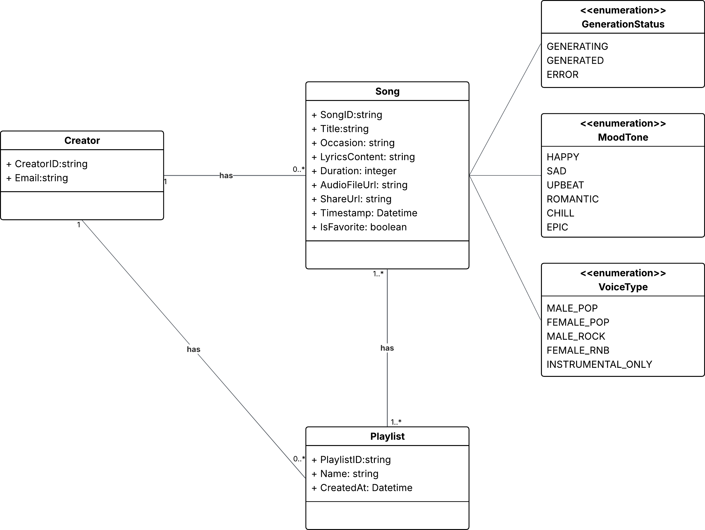

# AI Generation Song Web Application

AI-powered song generation app. Describe an occasion, pick a mood and voice — get a unique song in minutes.

---

## Quick Start with Docker (recommended)

### Prerequisites

- [Docker Desktop](https://www.docker.com/products/docker-desktop/) installed and running

### 1. Clone the repository

```bash
git clone <repo-url>
cd SWD_AI_generation_song
```

### 2. Create environment files

**Backend** — create `.env` in the project root:

```bash
cp .env.example .env   # or create manually (see below)
```

`.env` variables:

```env
# AI generation strategy: "mock" (no API key needed) or "suno"
GENERATOR_STRATEGY=mock

# Required only when GENERATOR_STRATEGY=suno
SUNO_API_TOKEN=your_suno_api_token
SUNO_API_BASE_URL=https://api.sunoapi.org
CALLBACK_BASE_URL=http://localhost:8000

# Required only when GENERATOR_STRATEGY=gemini (lyrics generation)
GEMINI_API_KEY=your_gemini_api_key
```

**Frontend** — create `frontend/.env.local`:

```bash
cp frontend/.env.local.example frontend/.env.local   # or create manually
```

`frontend/.env.local` variables:

```env
NEXT_PUBLIC_API_BASE_URL=http://localhost:8000/api

# next-auth v5 — Google OAuth
AUTH_SECRET=any_random_string_at_least_32_chars
AUTH_GOOGLE_ID=your_google_client_id
AUTH_GOOGLE_SECRET=your_google_client_secret
```

> **Getting Google OAuth credentials:**
>
> 1. Go to [Google Cloud Console](https://console.cloud.google.com/) → APIs & Services → Credentials
> 2. Create OAuth 2.0 Client ID (Web application)
> 3. Add `http://localhost:3000/api/auth/callback/google` to Authorized redirect URIs
> 4. Copy Client ID and Client Secret into `frontend/.env.local`

### 3. Build and run

```bash
docker compose up --build
```

First build takes ~3–5 minutes (installs Python + Node deps and builds Next.js).

### 4. Open the app

| Service  | URL                       |
| -------- | ------------------------- |
| Frontend | http://localhost:3000     |
| Backend  | http://localhost:8000/api |

### Stopping

```bash
docker compose down
```

### Rebuilding after dependency changes

```bash
docker compose up --build
```

---

## Manual Setup (development)

### Prerequisites

- [Python 3.12+](https://www.python.org/downloads/)
- [Node.js 22+](https://nodejs.org/)

### 1. Backend

```bash
# Create and activate virtual environment
python3 -m venv .venv
source .venv/bin/activate        # macOS / Linux
# .venv\Scripts\activate         # Windows

# Install dependencies
pip install -r requirements.txt

# Create .env (see variables above)
cp .env.example .env

# Run migrations
python manage.py migrate
```

### 2. Frontend

```bash
cd frontend
npm install

# Create frontend/.env.local (see variables above)
```

### 3. Run both services

```bash
# From project root — starts frontend (port 3000) + backend (port 8000)
bash start-dev.sh
```

Or run separately:

```bash
# Terminal 1 — backend
source .venv/bin/activate
python manage.py runserver 0.0.0.0:8000

# Terminal 2 — frontend
cd frontend
npm run dev
```

---

## Documentation

### Domain Diagram



### Architecture Diagrams

| Diagram                                               | Description                                                                                                                                           |
| ----------------------------------------------------- | ----------------------------------------------------------------------------------------------------------------------------------------------------- |
| [Layer Architecture](./architecture.md)               | UI / Controller / Model layer breakdown with color-coded Mermaid class diagram                                                                        |
| [Generate Song Sequence](./generate-song-sequence.md) | Full sequence diagram for song generation flow including 9 alternative use cases (validation errors, Suno failures, mock strategy, callback handling) |

### CRUD API Reference

Base URL: `http://localhost:8000/api`

---

#### Song

| Operation         | Method | URL                                |
| ----------------- | ------ | ---------------------------------- |
| List songs        | GET    | `/api/songs/`                      |
| Get a song        | GET    | `/api/songs/{song_id}/`            |
| Generate a song   | POST   | `/api/songs/generate/`             |
| Update a song     | PUT    | `/api/songs/{song_id}/update/`     |
| Delete a song     | DELETE | `/api/songs/{song_id}/delete/`     |
| Regenerate a song | POST   | `/api/songs/{song_id}/regenerate/` |

---

#### PlayList

| Operation            | Method | URL                                             |
| -------------------- | ------ | ----------------------------------------------- |
| List playlists       | GET    | `/api/playlists/`                               |
| Get a playlist       | GET    | `/api/playlists/{playlist_id}/`                 |
| Create a playlist    | POST   | `/api/playlists/create/`                        |
| Update a playlist    | PUT    | `/api/playlists/{playlist_id}/update/`          |
| Delete a playlist    | DELETE | `/api/playlists/{playlist_id}/delete/`          |
| Add song to playlist | POST   | `/api/playlists/{playlist_id}/songs/{song_id}/` |
| Remove song          | DELETE | `/api/playlists/{playlist_id}/songs/{song_id}/` |

---

#### Creator

| Operation      | Method | URL                                  |
| -------------- | ------ | ------------------------------------ |
| List creators  | GET    | `/api/creators/`                     |
| Sync creator   | POST   | `/api/creators/sync/`                |
| Get a creator  | GET    | `/api/creators/{creator_id}/`        |
| Update creator | PUT    | `/api/creators/{creator_id}/update/` |
| Delete creator | DELETE | `/api/creators/{creator_id}/delete/` |

---

#### Error responses

| Status | Meaning                                      |
| ------ | -------------------------------------------- |
| 400    | Validation error — missing or invalid fields |
| 404    | Resource not found                           |
| 405    | Method not allowed                           |

---
