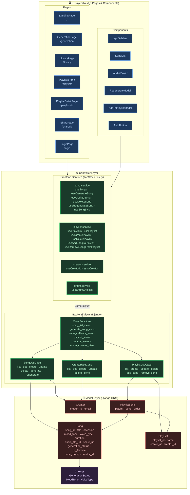

# Layer Architecture Diagram



## Layer Summary

| Layer                              | Color                | Responsibility                                         |
| ---------------------------------- | -------------------- | ------------------------------------------------------ |
| **UI — Pages**                     | Blue (dark)          | Route-level screens, compose components                |
| **UI — Components**                | Blue (light border)  | Reusable UI blocks, no direct API calls                |
| **Controller — Frontend Services** | Green (dark)         | HTTP calls, caching, mutation via TanStack Query       |
| **Controller — Backend Views**     | Green (light border) | Request routing, use-case orchestration                |
| **Model — Entities**               | Red                  | Django ORM models, DB schema                           |
| **Model — Choices**                | Purple               | Enum constants (GenerationStatus, MoodTone, VoiceType) |

```

```
