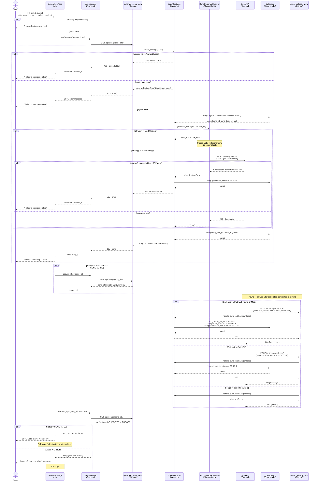

# Generate Song — Sequence Diagram

## Alternative Flows Summary

| # | Trigger | Result |
|---|---------|--------|
| 1 | Frontend form missing fields | Zod validation error — no API call |
| 2 | Backend missing/invalid fields | 400 ValidationError — song not created |
| 3 | Creator not found in DB | 400 ValidationError — song not created |
| 4 | Suno API unreachable / HTTP error | Song saved as ERROR, 502 returned |
| 5 | MockStrategy active | No Suno call — local audio URL used |
| 6 | Callback arrives with failure status | Song marked ERROR |
| 7 | Callback task_id not in DB | 404 returned to Suno |
| 8 | Poll finds GENERATED status | Audio player shown, polling stops |
| 9 | Poll finds ERROR status | Error message shown, polling stops |
